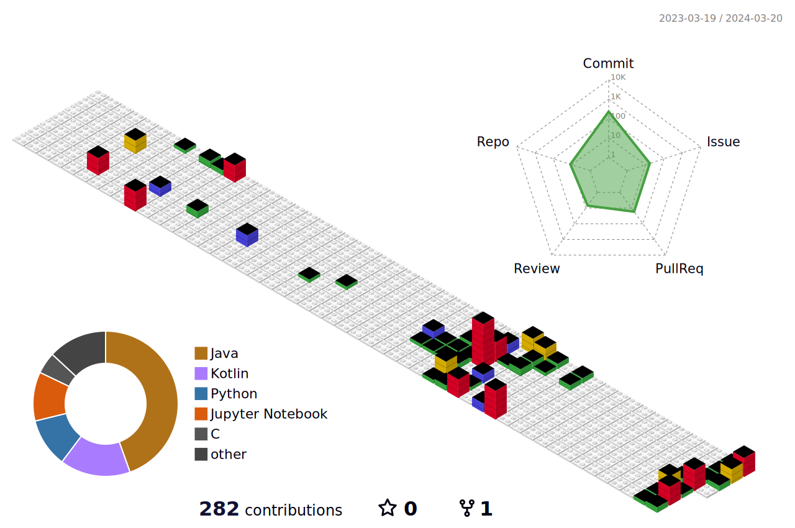

<h2>🛠️TECH STACKS🛠️</h2>

<h4>Techs that I've used at least once</h4>

 
   
  
  
   
   
  
   
   
   
   
  
   
   
  
   

   
   
   
  
  
  
   

 

<h2>✏️Currently Studying & Interested In✏️</h2>

  
  
   
   
  <h2>📊 OOSEDUS's Stats 📊</h2>

 

<!---->

